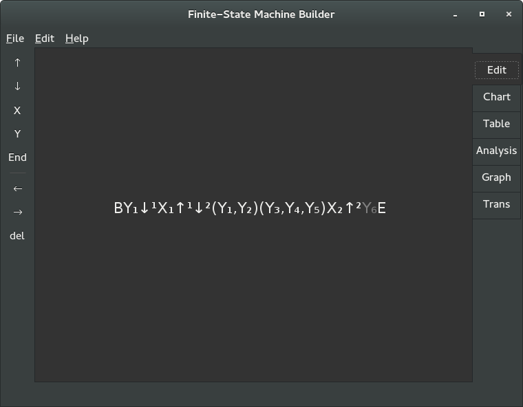
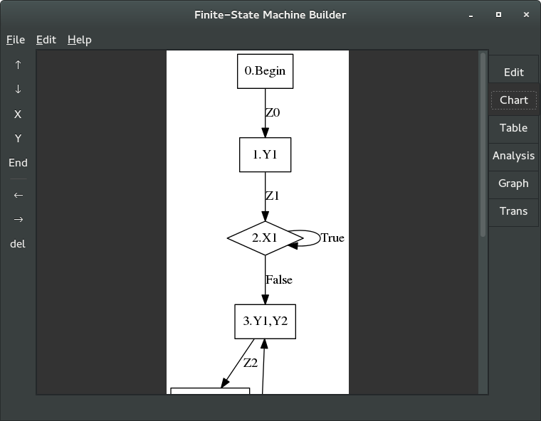
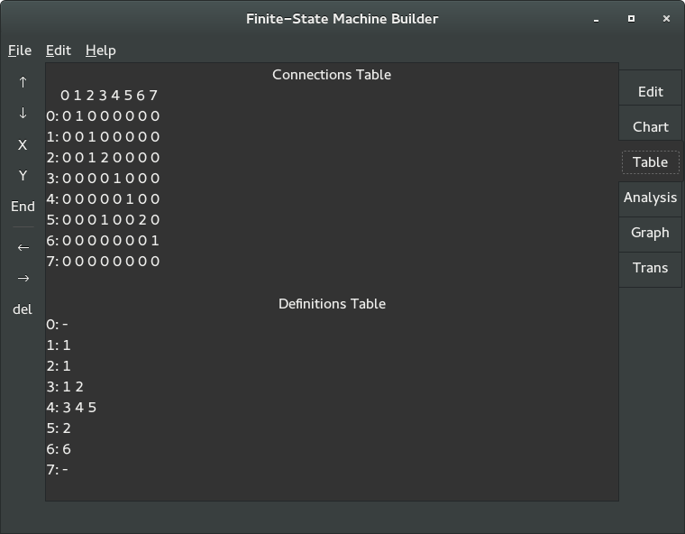
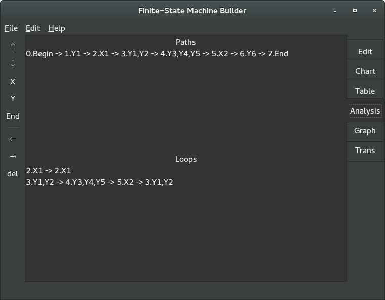
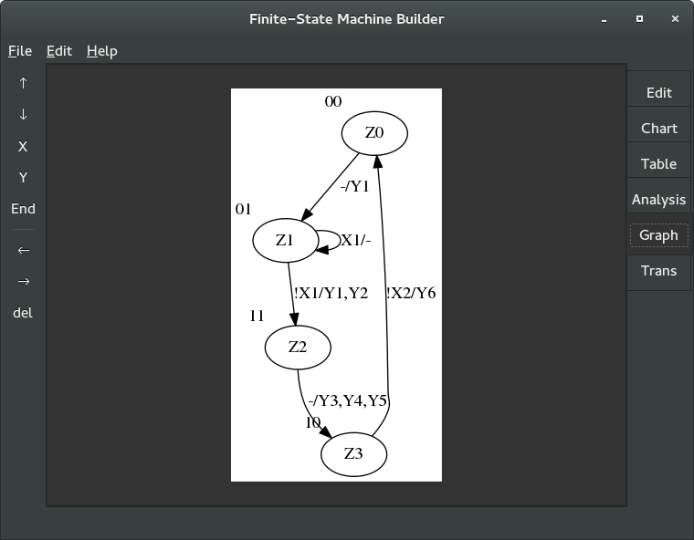
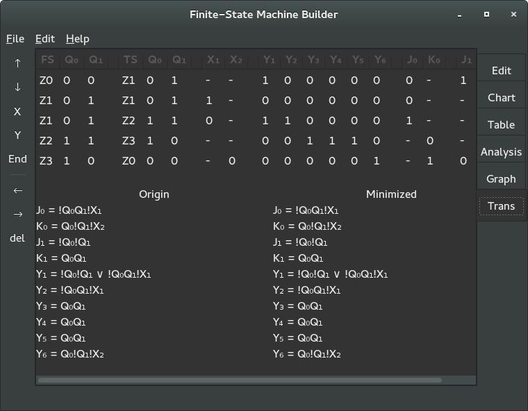

Finite-state machine Builder
============================
Program helps to create algorithm and then generate VHDL code for it.

Main features
-------------
  - algorithm editing and validation
  - chart visualization
  - algorithm analyze
  - Mealy graph of state machine
  - trigger and signal functions minimisation
  - generation of VHDL code
  
Algorithm editor
----------------
Use toolbar or ``Shif+key`` hotkeys to change algorithm.
  - ``Shift+arrows`` for navigation
  - ``Shift+x`` add condition block next to the cursor
  - ``Sift+y`` add operation block next to the cursor
  - ``Sift+backspace`` delete block under cursor

Flowchart visualization
-----------------------
Next tab has flowchart of entered algorithm.

Tables
------
*Table* tab include two tables:
  - connections table (2 means connection by ``false``)
  - definitions table

Algorithm analysis
------------------
*Analysis* tab contains all paths and loops.

Graph
-----
Next tab has Mealy graph of generated finite-state machine.
Dashed nodes - additional ones for neighboring coding.

Transition table and functions
------------------------------
Last tab contains complete transition table and both origin and minimized functions of output signals and triggers.

VHDL code generation
--------------------
Use ``File->Export VHDL`` to get code of your finite-state machine.

Program generates all minimized signal and trigger functions.
